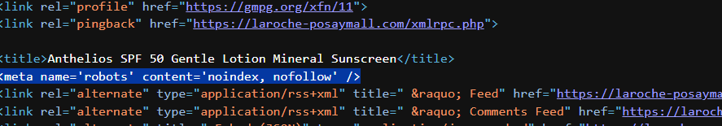

# Fraud-Cluster-OSINT-Investigation

**Tools:** WHOIS (RIPE, ARIN) · RIPEstat · BGP Looking Glass (Hurricane Electric) · ViewDNS Reverse-IP · Shodan · Google Safe Browsing
**Type:** Open-Source Intelligence (OSINT) · Threat Intelligence · Infrastructure Attribution · Brand Protection

> This investigation was independently initiated after encountering a suspicious e-commerce link. All reconnaissance, attribution, verification and disclosure reporting were self-directed.

> ⚠️ **Disclaimer:** This investigation was conducted entirely through passive, publicly available reconnaissance such as WHOIS records, DNS lookups, BGP routing data, and passive-DNS/reverse-IP services. No active exploitation, unauthorized access or interaction with checkout/payment systems was performed at any stage. All findings were reported to the relevant registrar, hosting provider and Google Safe Browsing through standard abuse-reporting channels.

---

## Investigation Result

**1 suspicious e-commerce domain → 173-domain fraud cluster → 20+ impersonated brands → shared hosting infrastructure → multi-channel reporting → post-remediation validation**

### Key Findings

| Finding | Evidence |
|---|---|
| 173 domains shared one IP | Reverse-IP + passive DNS (ViewDNS, cross-checked via Shodan) |
| 20+ brands impersonated | Manual domain/content review |
| Two related La Roche-Posay domains (iterative pattern) | WHOIS + lifecycle analysis |
| Additional cluster members verified as fraudulent | 2 independent manual spot-checks |
| Reported domain(s) blocked at browser level | Google Safe Browsing |
| Underlying infrastructure remained operational post-report | Control-domain re-test + server re-scan |

---


## TL;DR

Investigated a single suspicious e-commerce link and traced it through domain WHOIS, DNS resolution, IP WHOIS and BGP/ASN analysis to a shared hosting IP serving **173 counterfeit storefronts** impersonating 20+ unrelated trademarked brands, all built from an identical template. Verified the cluster via independent tools and manual spot-checks, reported findings across four channels (registrar, hosting provider, Google Safe Browsing, RIPE), and tested the real-world effect of that reporting; finding that domain-level blocklisting protected reported URLs but left the underlying fraud infrastructure fully operational.

**Note on scope:** This investigation confirms a shared, templated fraud *cluster* where a single hosting infrastructure is serving 173 coordinated fraudulent domains. It does not confirm a commercial fraud-as-a-service business model (i.e., whether this infrastructure is operated by one actor or rented out to multiple independent operators); that distinction was outside what passive OSINT could determine here.

---

## Overview

This investigation began with a single product link that resolved to a domain impersonating a real skincare brand (La Roche-Posay). Rather than dismissing it, the domain was traced through successive layers of internet infrastructure (registrar, DNS, hosting IP, and Autonomous System) to determine who actually controlled it and whether it was an isolated incident.

**The goal was to answer a real threat-intel question: is this one fake storefront, or is it part of something larger? And if it's larger, what does reporting it actually accomplish?**

**What this investigation demonstrates end-to-end:**

1. Content-level triage of a suspected fraudulent website using observable page indicators
2. Domain-layer attribution via WHOIS (registrar, registration date, nameservers)
3. Network-layer attribution via IP WHOIS (RIPE database, hosting organization, abuse contact)
4. Routing-layer attribution via BGP/ASN lookup (Hurricane Electric looking glass, RIPE `aut-num` records)
5. Infrastructure pivoting via reverse-IP/passive-DNS lookup, revealing a 173-domain fraud cluster
6. Manual verification of cluster findings via independent spot-checks
7. Multi-channel abuse reporting (registrar, hosting provider, Google Safe Browsing, RIPE NCC)
8. Post-report verification testing whether remediation actually disrupted the underlying infrastructure

---

## Investigation Architecture

```
┌──────────────────────────────────────────────────────────────────────┐
│                     Public Internet Infrastructure                   │
│                                                                      │
│   laroche-posaymall.com                                              │
│   (Registrar: Dynadot Inc, created 2026-08-22)                       │
│            │                                                         │
│            │ DNS Resolution                                          │
│            ▼                                                         │
│   212.52.28.245                                                      │
│   (Netname: RASHOST-US, range 212.52.28.128/25)                      │
│            │                                                         │
│            │ Reverse-IP / Passive DNS Pivot                          │
│            ▼                                                         │
│   173 domains resolving to this single IP                            │
│   [brand name] + mall / sale / store / deal / shop / gift / life     │
│            │                                                         │
│            │ Routing / ASN Attribution                               │
│            ▼                                                         │
│   AS199242 "malakmadze" - Malakmadze Web LLC                         │
│   Country: Georgia · 30 prefixes · 7,680 IPv4 addresses              │
│   Responsible org (IP block): Beijing Ruihao Kai Yuan Technology Co. │
│   Abuse contact: malakmadzeweb@gmail.com (personal address)          │
└──────────────────────────────────────────────────────────────────────┘
```

| Layer | Entity | Role |
|---|---|---|
| Domain registrar | Dynadot Inc | Registered `laroche-posaymall.com`, 2026-08-22 |
| Hosting IP | 212.52.28.245 | Serves 173 domains via name-based virtual hosting |
| IP block responsible org | Beijing Ruihao Kai Yuan Technology Co., Ltd | Registered responsible party for 212.52.28.128/25 |
| ASN / network operator | AS199242, Malakmadze Web LLC | Announces the IP block; Georgia-registered |

---

## Content-Level Triage

A product page for "Anthelios SPF 50" resolved to `laroche-posaymall.com`, not an official La Roche-Posay domain.

**Indicators identified:**

| Indicator | Finding |
|---|---|
| Pricing | ~75-80% below authentic retail across entire catalog |
| Page metadata | `<meta name="robots" content="noindex, nofollow">` |
| Trust badges | Sourced from a third-party theme demo site, not a real payment processor |
| Site construction | Generic WordPress/WooCommerce/Elementor template |
| Contact info | Residential-sounding US address, unaffiliated with L'Oréal |

### Page Metadata


---

## Domain-Layer Attribution (WHOIS)

```
Registrar:        Dynadot Inc
Registrant:        Redacted (Dynadot Super Privacy Service)
Created:            2026-08-22
Nameservers:       ns1.dyna-ns.net, ns2.dyna-ns.net
```

**Key finding:** domain age (11 days between registration and a full multi-category storefront appearing) is inconsistent with organic business growth and was treated as a strong fraud indicator.

### WHOIS Record


---

## Network-Layer Attribution (IP WHOIS)

DNS resolution of the primary domain returned **212.52.28.245**. Top-level WHOIS queries (ARIN) returned only generic RIPE NCC allocation data; querying RIPE's database directly for the specific address returned the granular assignment record:

```
inetnum:      212.52.28.128 - 212.52.28.255
netname:      RASHOST-US
org:          Beijing Ruihao Kai Yuan Technology Co., Ltd
country:      US
abuse-c:      abuse@rashost.com
```

### RIPE inetnum Record


---

## Routing-Layer Attribution (BGP / ASN)

Cross-referenced via Hurricane Electric's BGP looking glass and RIPE's `aut-num` object:

```
ASN:                  AS199242 ("malakmadze")
Operator:              Malakmadze Web LLC
Country of origin:    Georgia
BGP peers observed:   1 (AS19257, Subrigo Corporation)
Prefixes announced:   30  (7,680 IPv4 addresses total - confirms uniform /24 sizing)
Registered abuse contact: malakmadzeweb@gmail.com

Registry remark: "our ai-assisted firewall will block the content
                  on the network level."
```

**Assessment:** A single observed BGP peer is consistent with a small or newer network, though not conclusive on its own. A personal Gmail address as the registered abuse contact for a 7,680-address ASN is non-standard relative to typical network-operator practice. The registry's stated content-filtering claim is directly contradicted by observed findings below - this specific point is a verified factual contradiction, not an inference.

### RIPE aut-num Object - Gmail Contact + Firewall Remark

---

## Infrastructure Pivot (Reverse-IP / Passive DNS)

A reverse-IP lookup on 212.52.28.245 (ViewDNS.info, cross-checked against Shodan historical scan data) returned **173 domains** resolving to the same server, following a consistent naming template:

```
[typosquatted brand name] + [generic retail suffix]
Suffixes observed: -mall, -sale, -store, -shop, -deal, -life, -gift, -offer, -link
```

**Confirmed impersonated brands (non-exhaustive, 20+ identified):** La Roche-Posay, Otterbox, Skinceuticals, The North Face, Vera Bradley, Cole Haan, Patagonia, Anastasia Beverly Hills, Charlotte Tilbury, Diptyque, Bose, J.Crew, MZ Wallace, Suitsupply, Peak Design, Similac, Golden Goose, Ilia Beauty, Hourglass Cosmetics, Byoma, Caudalie, Le Creuset, Timberland, Gap Factory, Vortex Optics, Uppababy.

**TLD distribution** was weighted toward low-cost, weakly-vetted TLDs (`.vip`, `.sbs`, `.cyou`, `.lol`, `.lat`, `.it.com`) commonly associated with high-abuse registration patterns.

**Lifecycle pattern identified:** two sequential domains targeting the same brand were found - `laroche-posaylife.com` (created 2026-08-15, offline prior to this investigation) and `laroche-posaymall.com` (created 2026-08-22) suggesting an iterative replace-on-takedown operational model that predates this investigation.

### ViewDNS 173-Domain List


---

### Server Fingerprint (Shodan)

```
OS:            Linux
Web server:   Nginx
Open ports:   22/tcp (OpenSSH 9.6p1, Ubuntu), 80/tcp (HTTP)
```

Root HTTP response on port 80 returns a minimal default page - individual storefronts are served via **name-based virtual hosting** (per-domain `Host:` header routing), confirming a single server mass-hosting 173 independently-branded fraud domains.

### Shodan Host Page


---

## Manual Verification

Two additional domains from the reverse-DNS list were independently spot-checked (not assumed from naming pattern alone):

| Domain | Result |
|---|---|
| `otterboxdeal.com` | Confirmed fraudulent storefront, matching template |
| `skinceuticalsmall.com` | Confirmed fraudulent storefront, matching template |

---

## Multi-Channel Abuse Reporting

| Channel | Action | Outcome |
|---|---|---|
| **Google Safe Browsing** | URL submitted for phishing review | Domain subsequently flagged with a Chrome "Dangerous site" browser warning |
| **Dynadot** (registrar) | Formal abuse webform, category: Phishing | Case `ddcn:857X7y70h7z8A7r` opened, confirmed under investigation. No domain-hold status applied as of this writing. |
| **Rashost** (hosting abuse contact) | Email report to abuse@rashost.com | Reply received in under 2 hours from a different address (the ASN's registered personal Gmail contact) |
| **RIPE NCC** | Reported non-standard abuse contact and contradicted firewall claim | Resolved as out-of-scope - RIPE confirmed it does not investigate abuse reports, only maintains registry contact data |

### Dynadot Case Confirmation Email


---

## Abuse-Response Analysis

The reply received from AS199242's registered abuse contact exhibited several characteristics inconsistent with genuine abuse handling:

**Response received (summarized):** Claimed an "AI-assisted firewall" had added the reported domains to a "permanent abuse database," cited a non-standard "DMCA Registration Number," referenced 17 U.S.C. §512 and the EU Digital Services Act's "mere conduit" provisions, and requested verification via third-party proxy services (`proxysite.com`, `croxyproxy.com`, and others).

### The Rashost/Malakmadze Abuse Response Email


**Analysis:**

| Signal | Assessment |
|---|---|
| Response latency (<2 hours) | Rapid response is notable given the scope of the report (173 domains), but latency alone is not evidence of automated or non-genuine review — this is contextual, not conclusive |
| "AI-assisted firewall" claim | Repeats, near-verbatim, the RIPE registry remark already contradicted by observed live fraud domains - this repetition, not the claim's existence alone, is the stronger signal |
| Proxy-site verification request | An unusual verification method to request - genuine network-level blocking would not typically require a change in client device, cache state, or network path to observe |
| Sender/recipient mismatch | Reply originated from the ASN's personal Gmail abuse contact despite being sent to the separately-branded `abuse@rashost.com`, suggesting the "Rashost" hosting brand and the ASN operator are operationally linked, though the exact relationship (same entity vs. close partnership) was not independently confirmed |

**Conclusion:** Taken individually, none of these signals is conclusive. Taken together, the pattern is more consistent with a deflection-oriented abuse-response process than with genuine remediation. Though this remains an inference from indirect evidence, not a confirmed finding about the operator's intent or knowledge.

---

## Post-Report Verification

Rather than assume reporting was effective once the primary domain became inaccessible, I re-tested the underlying infrastructure directly:

| Test | Result |
|---|---|
| `laroche-posaymall.com` (reported) | Google Safe Browsing warning triggered |
| `bosesonline.com` (unreported, same cluster) | Google Safe Browsing warning also triggered |
| `acornshop.vip` (unreported, same cluster - control) | **Fully accessible, no warning** |
| 212.52.28.245 (Shodan re-scan) | **Server still online**, unchanged fingerprint (same SSH/nginx signature, same open ports) |

**Finding:** Based on the tests above, reporting produced **domain-level remediation, with no evidence of infrastructure-level remediation.** Google Safe Browsing's blocklist protects browser users from specifically-flagged URLs, but the shared hosting account and server enabling the broader operation showed no observable change. The unreported control domain and the server itself remained fully operational at time of testing; the status of the remaining ~170 unreported domains was not individually re-verified.

> This is the key analytic takeaway of the investigation: individual URL-blocklisting is valuable for immediate user protection but does not disrupt shared fraud infrastructure at its root. Meaningful disruption requires registrar or hosting-account-level action, which as of this writing has not been confirmed for this cluster.

### Actual Website


### Fraudulent Website

---

## Skills Demonstrated

- Domain WHOIS analysis and registrar attribution
- IP WHOIS / RIR hierarchy navigation (ARIN → RIPE, top-level vs granular `inetnum` records)
- BGP/ASN analysis via looking-glass tooling (Hurricane Electric)
- Reverse-IP / passive-DNS infrastructure pivoting
- Passive server fingerprinting (Shodan)
- Cluster hypothesis verification via independent spot-checks (not assumption from pattern alone)
- Multi-channel abuse/disclosure reporting (registrar, hosting, browser-blocklist, regional registry)
- Abuse-response critical analysis (identifying deflection patterns vs genuine remediation)
- Post-remediation verification testing (confirming reported fixes actually addressed root cause)
- Responsible disclosure sequencing (reporting before publication)

---

## Indicators of Compromise (IOC) Summary

```
Type: Phishing / Brand Impersonation / Counterfeit E-commerce Fraud

Primary domain:          laroche-posaymall.com
Related (offline):       laroche-posaylife.com
Secondary asset domain:  laroche-poosay.it.com
Resolved IP:              212.52.28.245
IP range:                 212.52.28.128/25
ASN:                      AS199242 (Malakmadze Web LLC)
Hosting brand:            RASHOST-US
Responsible org:          Beijing Ruihao Kai Yuan Technology Co., Ltd
Registrar:                Dynadot Inc
Domain created:           2026-08-22
Confirmed cluster size:   173 domains (reverse-DNS, cross-verified via 2 tools)
Spot-verified fraud:      otterboxdeal.com, skinceuticalsmall.com
Post-report status:       laroche-posaymall.com, bosesonline.com - Safe Browsing flagged
                          acornshop.vip (unreported control) - still active
                          Server 212.52.28.245 - still online, unaffected
```

---

## References

- [RIPE Database Query](https://apps.db.ripe.net/db-web-ui/query)
- [Hurricane Electric BGP Toolkit](https://bgp.he.net)
- [ViewDNS Reverse IP Lookup](https://viewdns.info)
- [Shodan](https://www.shodan.io)
- [Google Safe Browsing - Report Phishing](https://safebrowsing.google.com/safebrowsing/report_phish/)
- [ICANN - Registrar Accreditation Agreement](https://www.icann.org/resources/pages/approved-with-specs-2013-09-17-en)

---

**Author:** Durga Sai Sri Ramireddy | MS Cybersecurity, University of Houston
[](https://linkedin.com/in/durga-ramireddy)
[](https://github.com/DurgaRamireddy)
